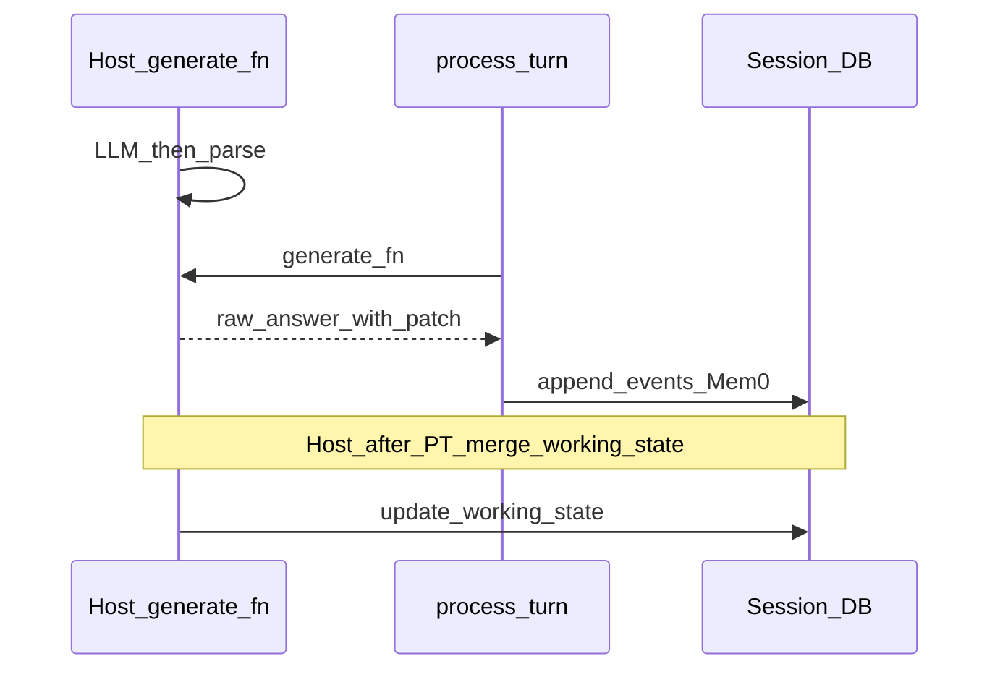

# LLM `WORKING_STATE_PATCH` — host integration guide

Structured **working state** (investigation scope, hypotheses, progress, constraints) is stored in Postgres (`session_working_state.working_state`) and included in the next turn’s session context. The **`memory_management`** library builds and reads that context, but **`process_turn()` does not** parse the model’s patch or persist it. The **host app** owns: prompt, parse, attach patch to `generate_fn`’s return value, and merge after `process_turn`.

This page is the **single source of truth** for that contract. Other docs link here.

---

## Prerequisites

- **`initialize(...)`** has run; session tables exist (`session_registry`, `session_working_state`, `session_conversation_turns`) — see [DATABASE_SETUP.md](DATABASE_SETUP.md).
- **`process_turn`** is in use with a real session provider (not a noop), so `result.provider` is available after each turn.
- Optional feature: if you skip everything below, the chatbot still works; you simply will not get **LLM-driven** updates to `working_state` (library compaction may still touch `compaction` fields).

---

## Protocol (must match the parser)

- The model emits the **user-visible answer first**, then on a **new line** the exact prefix **`WORKING_STATE_PATCH:`** (this matches `PATCH_MARKER` in [`session_manager/services/working_state_extract.py`](../session_manager/services/working_state_extract.py)).
- After the colon, a **single JSON object**. Top-level keys allowed from the LLM: **`progress`**, **`hypotheses`**, **`investigation`**, **`constraints`** only.
- **Do not** ask the model to emit **`compaction`**; the library/session layer manages compaction flags and counters.
- If nothing changed: **`WORKING_STATE_PATCH: {}`**.

Valid shapes are enforced by Pydantic **`SessionState`** — see [`session_manager/core/schema.py`](../session_manager/core/schema.py).

**Parse in code:**

```python
from memory_management.session_manager.services.working_state_extract import (
    parse_llm_response_for_working_state,
)

answer_text, patch = parse_llm_response_for_working_state(raw_llm_response)
# answer_text = user-facing text (content before the marker, or full text if no marker)
# patch = dict or None
```

---

## Integration steps (minimal)

1. **Startup** — Same as always: `initialize(settings, get_connection, llm_summarize=..., ...)`.

2. **Prompt** — Append the **canonical instruction** (below) to the **same** user/system text your **chat** model sees. Adapt surrounding wording to your domain; keep the marker and JSON rules unchanged.

3. **`generate_fn`** — Signature is **`generate_fn(question, session_context, user_background, **kwargs)`**. Call your LLM → `parse_llm_response_for_working_state(raw)` → return an object `process_turn` understands:
   - **Answer string:** `str(result)` or `result.content` must be the **clean** answer (no `WORKING_STATE_PATCH` line) for session events and Mem0.
   - **Patch for the host:** expose `working_state_patch` on the same object (dict, or omit / `None` if no patch).

4. **`process_turn(..., generate_fn=...)`** — Unchanged. It appends user/assistant messages, runs Mem0 `add`, compaction, etc. It **does not** write LLM patches to the DB.

5. **Immediately after a successful `process_turn`** — If `result.raw_answer` has a truthy `working_state_patch` and `result.provider`:
   - `current = result.provider.load_working_state(user_id, run_id)`
   - `merged = merge_working_state_patch(current, raw.working_state_patch)` from [`session_manager/services/state_merge.py`](../session_manager/services/state_merge.py)
   - If `merged is not None`: `result.provider.update_working_state(user_id, run_id, patch=merged, version=session_version)` (use the session row’s `version`, e.g. from `get_or_create_session`).

**Reference implementation (this repo):**

- Post-turn merge: [`src/api/endpoints.py`](../../src/api/endpoints.py) (comment: *App-specific: merge working_state_patch from pipeline*).
- Parse + attach to pipeline dict: [`src/rag/pipeline.py`](../../src/rag/pipeline.py) (`retrieve_and_generate` → `parse_llm_response_for_working_state`, `out["working_state_patch"]`).

---

## Canonical prompt block (copy-paste)

Append this paragraph to your **chat** user message (or equivalent). Replace only the **preceding** question/context framing with your own product copy.

```
After your answer, if this exchange updated what we're investigating, what we've done, or what we plan next, output on a new line: WORKING_STATE_PATCH: followed by a JSON object with only the keys that changed. Allowed keys only: progress (completed_steps, open_questions, next_actions), hypotheses, investigation, constraints. Do not include compaction. Valid JSON only. If nothing changed, output: WORKING_STATE_PATCH: {}
```

**Source in this repo:** [`src/rag/super_rag.py`](../../src/rag/super_rag.py) (user prompt suffix). A longer, HR-specific variant with examples lives in [`src/llm/bedrock_llm.py`](../../src/llm/bedrock_llm.py) (`generate_hr_response` user prompt).

---

## End-to-end flow



---

## Troubleshooting

| Symptom | Likely cause |
|--------|----------------|
| `working_state` never updates | No prompt; parse not called; patch not on `raw_answer`; post-`process_turn` merge block missing or `merge_working_state_patch` returned `None`. |
| Patch line appears in chat UI | Return **clean** `content` from `generate_fn`, not raw model output. |
| `merge_working_state_patch` returns `None` | JSON invalid for **`SessionState`** (unknown keys, bad types). Enable / inspect **`WORKING_STATE_TRACE_FILE`** — see [ENV_VARS.md](ENV_VARS.md). |
| Version / concurrency errors | Use current session **`version`** when calling `update_working_state`; provider retries once on conflict. |

---

## See also

- [GETTING_STARTED.md](GETTING_STARTED.md) — §10 next step after `process_turn`
- [INTEGRATION.md](INTEGRATION.md) — library vs host responsibilities
- [HOW_TO_USE_AS_LIBRARY.md](HOW_TO_USE_AS_LIBRARY.md) — how context reaches the LLM
