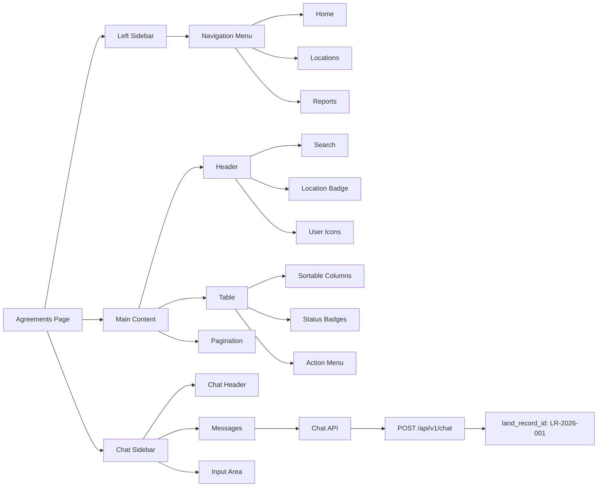

# Agreements Page Redesign Plan

## Overview
Transform the current card-based agreements landing page into a table-based layout matching the provided SVG design, add a hardcoded location ID "LR-2026-001" in the header, and re-implement the chatbot with a sidebar design.

## Key Changes from SVG Analysis

### 1. Layout Structure
- **Left Sidebar** (220px fixed): Dark navigation with "Home", "Location 1.0", "Location 1.1", "Land 1", "Camps", "Land 2", "Reports", "Data Management"
- **Main Content Area**: White background with table layout
- **Header**: Contains search bar, location ID "LR-2026-001", user profile icons
- **Table**: Sortable columns with status indicators (green "Pending update", yellow "Pending update", red "Deleted")
- **Right Sidebar** (fixed position): Chatbot interface when opened

### 2. Header Design
- Search bar (left side)
- Fixed location ID badge: "LR-2026-001" (yellow background)
- User profile and settings icons (right side)
- Sort dropdown showing "Sort by: name"

### 3. Table Design
From SVG analysis:
- Columns: Agreement Number | Date | Location | Status | Actions (...)
- Row examples visible:
  - `1/11/24 2:30 pm` with green "Pending update" badge
  - `1/11/24 2:32 pm` with yellow "Pending update" badge  
  - `1/11/24 2:34 pm` with red "Deleted" badge
- Pagination at bottom: "10" items shown
- Sortable column headers with dropdown indicators

### 4. Chatbot Sidebar (from SVG)
- Fixed right sidebar (356px width, rounded corners)
- Header: "Hi, My name is..." with close button
- Message area: Scrollable with auto-scroll
- Input area at bottom with send button
- Messages show: "How can I help you?" prompt
- User can type and send messages

## Implementation Steps

### Step 1: Update Agreement Interface
- Add `landRecordId` field (optional, defaults to "LR-2026-001")
- This will be sent to the chatbot API endpoint

**File**: `src/components/AgreementsLandingPage.tsx`

### Step 2: Create New Table-Based Layout
- Replace card grid with HTML table
- Implement sortable column headers
- Add status badge components (green/yellow/red)
- Add pagination controls
- Style to match SVG (gray background, white table)

**File**: `src/components/AgreementsLandingPage.tsx`

### Step 3: Create Left Sidebar Navigation
- Fixed 220px width sidebar
- Dark background (#000000)
- Navigation items with icons
- Collapsible sections (Location, Land, etc.)

**New File**: `src/components/Sidebar.tsx`

### Step 4: Redesign Header
- Add location ID badge component
- Position search, location badge, and user icons
- Match SVG styling (white background, borders)

**File**: Update header in `AgreementsLandingPage.tsx`

### Step 5: Re-implement Chatbot Component
Based on SVG, create new chatbot with:
- Fixed right sidebar (356px × full height)
- Rounded corners (border-radius: 15px)
- Header with title and close button
- Scrollable message area
- Input field at bottom
- Auto-scroll to new messages
- Send button

**New File**: `src/components/ChatSidebar.tsx`

### Step 6: Integrate Chatbot API
- Reuse API service from `src/services/apiService.ts`
- Send `land_record_id: "LR-2026-001"` with all requests
- Handle conversation state
- Display user/assistant messages

### Step 7: Update Routing & Layout
- Wrap agreements page with new sidebar layout
- Add chatbot toggle button (bottom-right FAB from previous design or header button)
- Ensure responsive behavior

**File**: `src/App.tsx` and layout components

## Technical Decisions

### Location ID Handling
- Hardcode `LR-2026-001` as a constant
- Pass to chatbot API as `land_record_id` parameter
- Display in header badge component

### Chatbot State Management
- Use React hooks (useState, useEffect, useRef)
- Session storage for conversation ID
- Auto-scroll with useLayoutEffect

### Styling Approach
- Tailwind CSS classes matching SVG colors
- Custom components for badges, table cells
- Fixed positioning for sidebars

## Files to Create/Modify

### New Files
1. `src/components/Sidebar.tsx` - Left navigation sidebar
2. `src/components/ChatSidebar.tsx` - Right chatbot sidebar
3. `src/components/ui/Badge.tsx` - Status badge component (if needed)

### Modified Files
1. `src/components/AgreementsLandingPage.tsx` - Complete redesign to table layout
2. `src/App.tsx` - Update routing to include sidebar layout
3. `src/services/apiService.ts` - Verify chatbot API integration

## SVG Color Reference
- Sidebar background: `#000000`
- Main background: `#F5F5F5`
- Table background: `#FFFFFF`
- Green badge: `#C7F3B1` border `#34982B`
- Yellow badge: `#FFFBE2` border `#C19800`
- Red badge: `#FCD8D9` border `#DD1F26`
- Blue accent: `#1582CF`

## Mermaid Diagram

## Notes
- The SVG shows a complete application layout, but we're focusing on the agreements page redesign
- Chatbot will be re-implemented from scratch to match SVG design
- Table will have full sorting and pagination features
- Location ID "LR-2026-001" is hardcoded as requested
